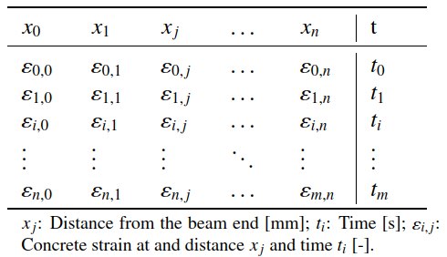

# Transfer Length Calculation based on DFOS data
# TLC_DFOS – Transfer Length Calculator

This is the **first release** of **TLC_DFOS**, a Windows desktop application for determining the transfer lengths of prestressed CFRP strands in concrete from DFOS strain–time data.

 

## How to run

1. **Download** `TLC_DFOS.zip` from the release page. 

2. **Extract** the ZIP file to a folder of your choice. 

3. **Double-click** `TLC_DFOS.exe` to start the application. 

   - *Windows only – no Python installation required.*

 

## Input data format

- Excel file (`.xlsx`) with:

  - **Columns 1..(n-1)**: strain values (column headers = sensor positions in mm, numeric) 

  - **Column n**: time in seconds
 
    
    

 

## Basic workflow

1. **Select** your Excel file. 

2. **Choose** analysis time: Integral Peak, First Measurement, or Manual Entry 

3. **Enter** $\Delta \varepsilon_c$ and $l_{ol}$ parameters (defaults provided). 

4. **View** plots. 

5. **Export** results and plots.

 

## Reference

*Experimental study of transfer length of prestressed CFRP strands using distributed fiber optic sensors.*

